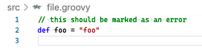

VSCode GroovyLint not following codenarc rulesets

## Run with gradle wrapper

```
./gradlew codenarcMain
```

- Expected: 1 UnnecessaryGString P3 error
- Actual: 1 UnnecessaryGString P3 error

## Run with npm-groovy-lint

```json
{
  "codenarcRulesets": "codenarc.groovy"
}
```

```
npm run lint
npm-groovy-lint --config .groovylintrc.json --failon info --path src
```

- Expected: 1 info
- Actual: 1 info

## Run with vscode

```json
{
  "codenarcRulesets": "codenarc.groovy"
}
```

```json
{
  "groovyLint.basic.config": ".groovylintrc.json",
  "groovyLint.basic.loglevel": "info",
  "groovyLint.fix.enable": true
}
```

- Expected: 1 info error
- Actual: No errors


